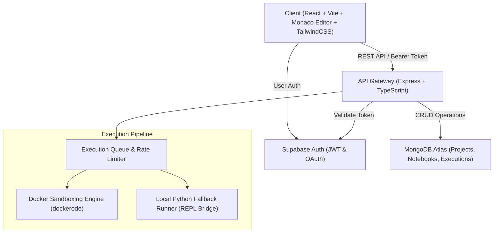

# 🚀 JIGRI — Next-Gen Cloud Code Platform

<div align="center">

  
  
  
  
  
  
  

  <p align="center">
    <b>A fast, secure, browser-first developer playground with multi-language compiler execution, interactive Jupyter-style Python Notebooks, live Web previews, and cloud persistence.</b>
  </p>

</div>

---

## 🌟 Key Features

### ⚡ 1. Multi-Language Online Compiler & Interpreter
- **12+ Supported Languages**: Python, JavaScript, TypeScript, C++, C, Java, Go, Rust, Ruby, PHP, Bash, HTML/CSS.
- **Isolated Execution Sandboxing**: Docker container sandboxing with zero network access, memory quotas, CPU limits, and PID throttling.
- **Interactive Stdin & Real-Time Logs**: Custom standard input support, execution timing, memory consumption, and exit code analytics.

### 📓 2. Interactive Python Notebook
- **Jupyter-Style Notebook Experience**: Code cells and rich Markdown documentation cells.
- **Persistent Python REPL Session**: Variable persistence across cell executions.
- **Rich Output Visualization**: Text, HTML, tabular data, and Matplotlib chart rendering.
- **Auto-Save & Cloud Sync**: Seamlessly saves your notebook changes to the cloud.

### 👤 3. Modern Authentication & Dashboard
- **Supabase Auth**: Fast Email/Password authentication and GitHub / Google OAuth integration.
- **Personal Developer Dashboard**: Manage saved code projects, notebook files, and historical execution logs.
- **Instant Search & Filter**: Find your projects by language, title, or last modified date.

### 🌐 4. Live Web & Markdown Studio
- **Sandboxed Web Preview**: Instant live rendering of HTML5, CSS3, and JavaScript code.
- **Real-Time Markdown Editor**: Live side-by-side parsed markdown preview with syntax highlighting.

---

## 🏛 Architecture Overview



---

## 🗂 Project Structure

```
jigri/
├── client/                     # Frontend (React 18, Vite, TailwindCSS, Monaco Editor)
│   ├── src/
│   │   ├── components/         # Compiler, Notebook, Dashboard, Auth & UI components
│   │   ├── features/           # Redux Toolkit slices (auth, notebook, compiler, project)
│   │   ├── hooks/              # Custom React hooks (useNotebook, etc.)
│   │   ├── pages/              # Landing, Compiler, Notebook, Dashboard, Settings
│   │   ├── services/           # Axios API client & endpoints
│   │   └── lib/                # Supabase client configuration
│   └── package.json
│
├── server/                     # Backend API (Node.js, Express, TypeScript)
│   ├── src/
│   │   ├── config/             # Environment variables and app configs
│   │   ├── execution/          # DockerRunner & language sandbox execution
│   │   ├── middleware/         # Auth, Rate limiting & error handlers
│   │   ├── models/             # Mongoose Models (Project, Notebook, Execution, User)
│   │   ├── notebook/           # RuntimeManager, REPL Bridge & Python session management
│   │   ├── routes/             # REST Endpoints (auth, projects, notebooks, compile)
│   │   └── index.ts            # Server entry point
│   └── package.json
│
├── docker/                     # Sandboxed Docker execution runners
│   ├── notebook-python/        # Interactive Python REPL runner
│   ├── runner-cpp/             # C++ GCC runner
│   ├── runner-python/          # Python isolated runner
│   └── build-runners.ps1 / .sh # Runner build scripts
│
└── docker-compose.yml          # Containerized multi-service configuration
```

---

## 💻 Tech Stack

| Layer | Technologies |
|---|---|
| **Frontend** | React 18, TypeScript, Vite, TailwindCSS, Monaco Editor, Lucide Icons, Redux Toolkit |
| **Backend** | Node.js, Express.js, TypeScript, Dockerode, Zod, Socket.IO |
| **Database** | MongoDB Atlas (Mongoose ODM) |
| **Authentication** | Supabase Auth (Email + OAuth) |
| **Execution Sandboxing** | Docker Container Isolation / Local REPL Subprocess |

---

## ⚙️ Environment Configuration

### Backend (`server/.env`)
```env
PORT=4000
NODE_ENV=development
CLIENT_URL=http://localhost:3000

# MongoDB Database Connection
MONGO_URI=mongodb+srv://<username>:<password>@<cluster>.mongodb.net/jigri?retryWrites=true&w=majority

# Supabase Auth
SUPABASE_URL=https://<your-project>.supabase.co
SUPABASE_ANON_KEY=<your-anon-key>

# Execution Security & Resource Limits
MAX_CONCURRENT_EXECUTIONS=10
MAX_EXECUTIONS_PER_USER=2
EXECUTION_TIMEOUT_MS=15000
NOTEBOOK_IDLE_TIMEOUT_MS=1800000
```

### Frontend (`client/.env`)
```env
VITE_API_URL=http://localhost:4000
VITE_SUPABASE_URL=https://<your-project>.supabase.co
VITE_SUPABASE_ANON_KEY=<your-anon-key>
```

---

## 🚀 Quick Start & Local Setup

### 1. Clone the repository
```bash
git clone https://github.com/your-username/jigri.git
cd jigri
```

### 2. Start the Backend
```bash
cd server
npm install
npm run dev
```

### 3. Start the Frontend
```bash
cd ../client
npm install
npm run dev
```
Open [http://localhost:3000](http://localhost:3000) in your browser.

---

## 🚢 Deployment Guide

### Deploying Frontend to **Vercel**
1. Import the `/client` directory into Vercel.
2. Configure **Environment Variables**:
   - `VITE_API_URL`: Your backend API URL (e.g. `https://jigri-server.onrender.com`)
   - `VITE_SUPABASE_URL`: Your Supabase Project URL
   - `VITE_SUPABASE_ANON_KEY`: Your Supabase Anon Key
3. Deploy!

### Deploying Backend to **Render**
1. Create a **Web Service** on Render pointing to the `/server` directory.
2. Build Command: `npm install && npm run build && pip install -r requirements.txt`
3. Start Command: `node dist/index.js`
4. Add **Environment Variables** (`MONGO_URI`, `SUPABASE_URL`, `SUPABASE_ANON_KEY`, `CLIENT_URL`, etc.).
5. Make sure **MongoDB Atlas Network Access** allows `0.0.0.0/0`.


---

## 🛡 Security & Isolation

- **Zero Network Access**: Code execution containers run with `NetworkMode: "none"` to prevent unauthorized network requests.
- **Resource Protection**: Memory caps (128MB–512MB) and CPU quotas (0.5 CPU) prevent resource exhaustion attacks.
- **Least Privilege Execution**: Docker capabilities dropped (`CapDrop: ['ALL']`) with `no-new-privileges` enabled.
- **Fork-Bomb Protection**: Strict process tree limit (`PidsLimit: 128`).

---

## 📄 License
This project is licensed under the **MIT License** — feel free to use and customize for your own projects!
